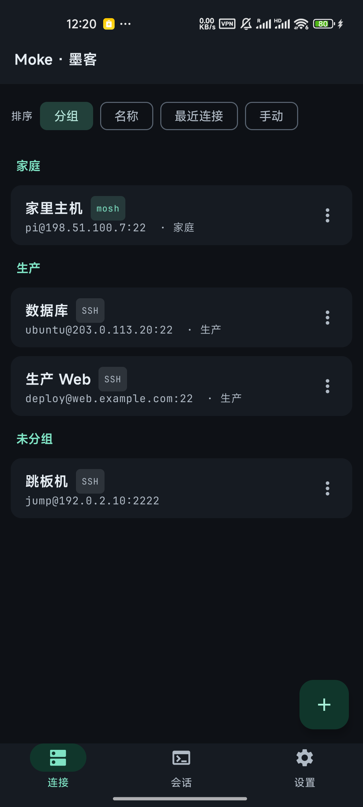
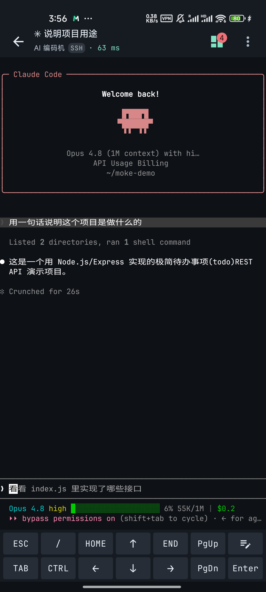
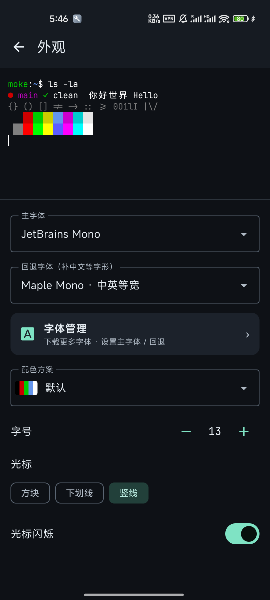
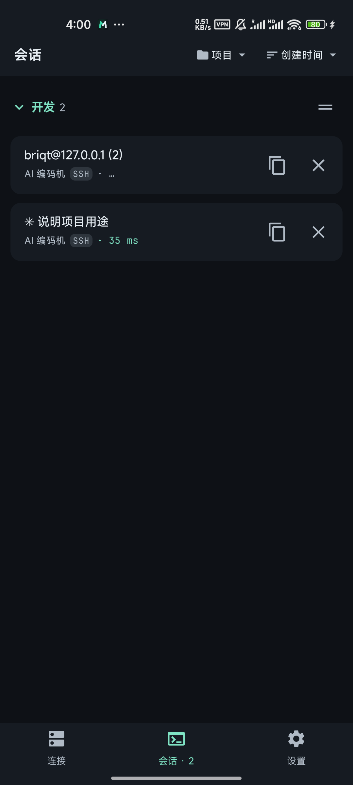

<div align="center">

# Moke · 墨客

**Native SSH / mosh terminal for Android** (Kotlin + Jetpack Compose)

[](https://github.com/briqt/moke/actions/workflows/ci.yml)
[](https://github.com/briqt/moke/releases)
[](#)

</div>

<p align="center"><b>English</b> · <a href="README.zh-CN.md">简体中文</a></p>

## What is this

Moke is a native SSH / mosh terminal for Android. It connects to remote servers directly inside the app — run a shell, tmux, vim, or a full-screen TUI such as Claude Code — and reuses termux's `terminal-view` / `terminal-emulator` (Apache-2.0) for terminal rendering instead of writing its own ANSI parser.

## Features

- **SSH**: password / private-key (PEM) auth; TOFU host-key verification; jump host (ProxyJump); run-on-login command; window resize; keep-alive heartbeat.
- **mosh**: bundled native `mosh-client` running as a separate subprocess over a PTY; UDP roaming (reconnect on screen-off / network switch).
- **Sessions & hosts**: multiple sessions stay resident and switch across screens, with a foreground service keeping connections alive in the background; group / sort (including manual drag-to-reorder); duplicate; per-session titles; protocol badges; copy connect command.
- **Terminal**: two-row extra keys + text-block input; copy & paste; pinch-to-zoom; swipe-to-scroll in full-screen TUIs (Claude Code, vim, … — over both SSH and mosh); a top status bar (protocol / host / latency); a tmux panel to attach / create / rename / kill remote sessions.
- **Appearance**: live preview; multiple dark color schemes; adjustable font size / line spacing / letter spacing; cursor style; font management (primary + CJK fallback — a bundled Noto Sans SC subset, plus downloadable Fira Code / Maple Mono / Hack and more).
- **Security & languages**: connection credentials are encrypted with the Android Keystore (AES-GCM) before being stored; bilingual English / 中文 (i18n), following the system language by default and switchable in Settings.

## Screenshots

<div align="center">
&nbsp;&nbsp;&nbsp;
<br/><sub>Host management · Terminal (SSH running Claude Code) · Appearance · Multiple sessions</sub>
</div>

## Install

From [Releases](https://github.com/briqt/moke/releases), pick one:

- `moke-vX.Y.Z.apk` — standard build; CJK fallback is a bundled Noto Sans SC subset (smaller).
- `moke-vX.Y.Z-maple.apk` — bundles Maple Mono as the default CJK fallback, monospaced CJK out of the box (larger).

Allow "install from unknown sources" and install. Release builds use a stable signature, so upgrades install over the top.

## Modules

| Module | Description | License |
|---|---|---|
| `app` | Product layer (Compose UI / session orchestration / transport implementations) | see [LICENSE](LICENSE) |
| `terminal-emulator` | Terminal parsing / state core (vendored; `TerminalSession` made transport-agnostic) | Apache-2.0 |
| `terminal-view` | Terminal rendering View (vendored; only small backward-compatible tweaks for line / letter spacing) | Apache-2.0 |

## Build

Requires JDK 17 + Android SDK (compileSdk 35 / build-tools 35). Create `local.properties` at the project root pointing to the SDK: `sdk.dir=/path/to/Android/sdk`.

```bash
./gradlew assembleStandardDebug   # standard debug APK
./gradlew testDebugUnitTest       # unit tests

# The `maple` flavor bundles Maple Mono as the default CJK fallback.
# Fetch the font first (OFL, ~20 MB, not checked in), then build:
./scripts/fetch-maple-font.sh && ./gradlew assembleMapleDebug
```

The mosh native artifacts are reproducibly built by [`scripts/build-mosh-native.sh`](scripts/build-mosh-native.sh) from public sources (mosh 1.4.0 + rjyo/mosh-android prebuilt libs); NDK r29 is required, and the GPLv3 binaries are not checked in. The `maple` flavor's bundled font is fetched by [`scripts/fetch-maple-font.sh`](scripts/fetch-maple-font.sh) (OFL, not checked in).

## Feedback

Only [issue](https://github.com/briqt/moke/issues)-based reports are accepted; pull requests are not accepted for now (see [CONTRIBUTING](CONTRIBUTING.md)).

## Acknowledgements & third-party

The terminal core reuses `terminal-emulator` / `terminal-view` from [termux/termux-app](https://github.com/termux/termux-app) (Apache-2.0, originally from [Android Terminal Emulator](https://github.com/jackpal/Android-Terminal-Emulator)). SSH transport uses [sshj](https://github.com/hierynomus/sshj). The mosh native component is based on [mobile-shell/mosh](https://github.com/mobile-shell/mosh) (GPLv3) and [rjyo/mosh-android](https://github.com/rjyo/mosh-android). The bundled Chinese font is a subset of [Noto Sans SC](https://github.com/notofonts/noto-cjk) (OFL). See [THIRD_PARTY_NOTICES.md](THIRD_PARTY_NOTICES.md) for the full list.

## License

See [LICENSE](LICENSE). The vendored `terminal-*` modules are Apache-2.0; the mosh native component is GPLv3 (a standalone executable, isolated at the boundary).
